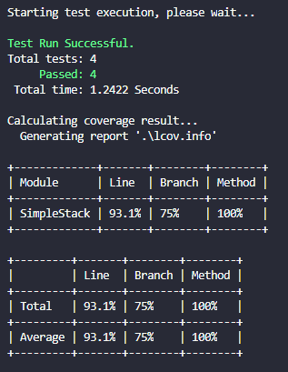
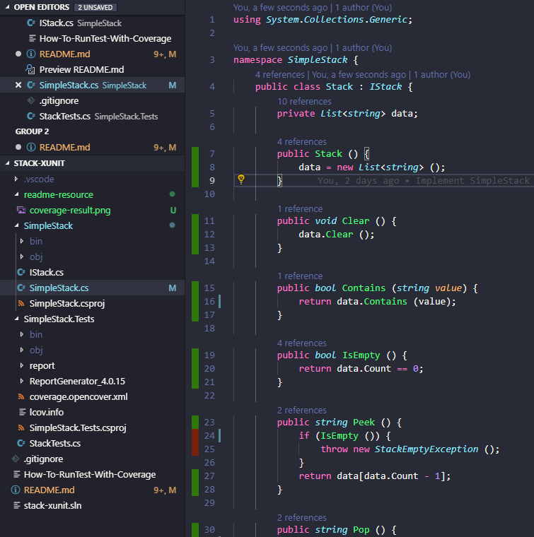

# Introduction

This project is a demo of combining some testing tools for C#/.NET Core:

- [xUnit](https://xunit.net/)

- [Coverlet](https://github.com/tonerdo/coverlet)

- [ReportGenerator](https://github.com/danielpalme/ReportGenerator)

The demo is about applying unit testing on a very simple Stack structure.

## Clone and run tests

```
git clone <the repo>

cd SimpleStack.Tests

dotnet test
```

## Run test with coverage

```
dotnet test /p:CollectCoverage=true /p:CoverletOutputFormat=lcov /p:CoverletOutput=./lcov.info
```



If you have installed [Coverage Gutters]() on your Visual Studio Code, you can see the coverage visualization like this



## Run test to get opencover output

## Generate coverage report from opencover result
